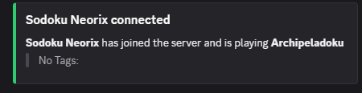
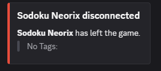
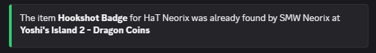
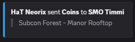
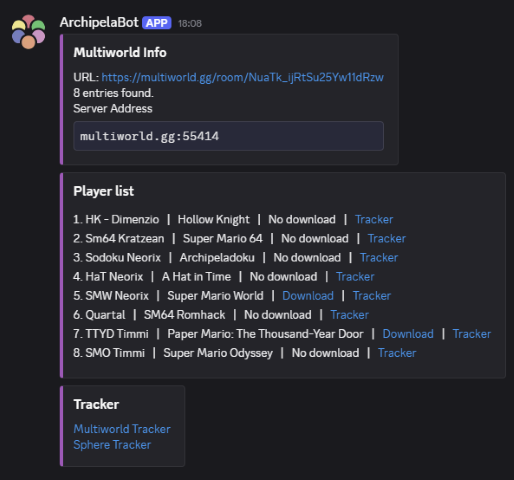
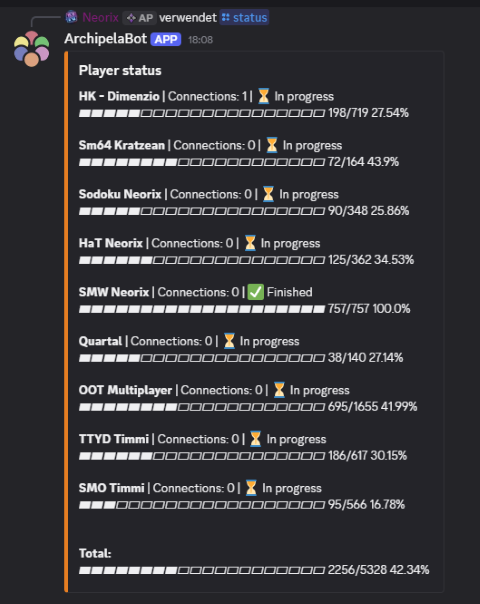
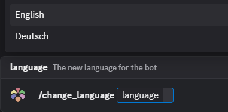

# ArchipelaBot

A powerful Discord bot for [Archipelago](https://archipelago.gg) that lets you monitor and control your Multiworld session directly from Discord.
[AP readme](README_archipelago.md)

---

## ✨ Features

- **Real-time Monitoring**: Stay updated with Archipelago server messages and events directly in Discord with beautiful embeds.

   

- **Execute Archipelago Commands**: Use commands from Discord and receive formatted responses with additional information compared to server output.

 

- **Multilingual Support**: Currently supports English and German.



---

## 🛠️ Setup

### Requirements
   - **Archipelago Launcher**: Download [here](https://github.com/ArchipelagoMW/Archipelago/releases/latest)
   - **Discord Bot Token**: Create one in the [Discord Developer Portal](https://discord.com/developers/applications), for help look in [here](#how-to-create-a-discord-bot-token)
### Installation

1. **Download the `archipelabot.apworld`**
   Download the latest release from [here](https://github.com/Neorix09/ArchipelaBot/releases).

2. **Install the APWorld**
   Open the AP Launcher and use the `Install APWorld` option to install the downloaded file.

3. **Restart the AP Launcher**
   Close and reopen the Launcher to register the bot.

4. **Start ArchipelaBot**
   Use the `Start ArchipelaBot` command from the Launcher to initialize the bot.

5. **Configure the Bot**
   - Use the `/set_token [YOUR_DISCORD_TOKEN]` command to add your Discord bot token.
   - *Optional:* If you have an admin role, use `/set_admin [YOUR_ADMIN_ROLE_ID]` to restrict admin commands to that role.
     - To find the role ID: Enable Developer Mode in Discord, right-click the role, and select "Copy User ID".
   - *Optional:* Use `/ap_admins` to toggle whether Archipelago admins can use admin commands in Discord.

<details>
<summary>Running from source</summary> 

### Requirements

- **Python**: [3.11.9 or newer (but less than 3.14)](https://www.python.org/downloads/)
- **Discord Bot Token**: Create one in the [Discord Developer Portal](https://discord.com/developers/applications), for help look in [here](#how-to-create-a-discord-bot-token)

### Installation

1. **Download the source Code**

2. **Install dependencies**:

   ```bash
   pip install -r requirements.txt
   ```

3. **Move the Files**:
   Move `Client.py` and the `locale` folder from `ArchipelaBot/worlds/archipelabot` to the `ArchipelaBot` root directory.

4. **Configure the bot**:
   Open `BotClient.py` and adjust the following variables in the `# --- Variables ---` section:

   - `run_form_source`: Set on false.
   - `gui_enabled`: Enable the normal AP Client interface. 

   - `Bot_token`: Your Discord Bot Token (required for connecting to Discord).
   - `Admin_role_id`: The Discord role ID for admin users (optional).
   - `ap_admins`: Enable/disable Archipelago admins for Discord admin commands.
   - `decimal_places_percent`: Number of decimal places for progress bar percentages.

---

## 🚀 Usage

1. **Launch the bot**:
   ```bash
   python Client.py
   ```
2. **Connect to your session**:
   Once the bot is online, use the `/connect` or `/start_server` command to connect to your Archipelago session.
</details>

<details>
<summary>Discord Token Help</summary>

### How to Create a Discord Bot Token:

1. Go to the [Discord Developer Portal](https://discord.com/developers/applications)
2. Click "Create"
3. Then "Build a bot for your server or community"
4. Give a Name 
4. Go to the "Bot" section
5. Under "TOKEN", click "Reset Token" then copy your bot token
6. Search for "Message Content Intent" and enable it.
7. Go to "OAuth2" → "URL Generator"
8. Select scopes: `bot`
9. Select permissions: `Send Messages`, `Embed Links`, `Use Slash Commands`
10. Copy the generated URL and open it in your browser to invite the bot to your Discord server

**⚠️ Important:** Never share your bot token with anyone!

</details>

---

## Commands

### Types:
- **Normal:** Can be used by erveryone
- **Archipelago Admin**: Can only be used from people, wo used the `/admin_login` with the correct passwort.
- **Discord Admin:** Can be used from the Admin role if set

| Command            | Description                                                       | Type
| :----------------- | :---------------------------------------------------------------- |:-------------------------
| `/help`            | List all available commands                                       |Normal
| `/set_server`      | Set the Archipelago server address (IP and Port)                  |Discord Admin
| `/connect`         | Connect to a specific slot on the server                          |Normal
| `/disconnect`      | Disconnect from the current server                                |Discord Admin
| `/status`          | Show current progress of all players with progress bars           |Normal
| `/players`         | List all connected and offline players                            |Normal
| `/add_website`     | Store an Archipelago website URL for automatic info retrieval     |Discord Admin
| `/list_info`       | Fetch tracker links and download information from the website     |Normal
| `/start_server`    | Starts the server via the specified website and connects directly |Normal
| `/admin_login`     | Open a login modal to get admin permissions                       |Normal
| `/save`            | Save the current Multiworld state (Admin only)                    |Normal after the bot is logged as admin
| `/hint`            | Request a hint for a specific item (Admin only)                   |Archipelago Admin
| `/hint_location`   | Request a hint for what is at a location (Admin role only)        |Archipelago Admin
| `/change_channel`  | Change the Discord channel for server messages (Admin role only)  |Discord Admin
| `/change_language` | Change the bot's language (Admin only)                            |Discord Admin
